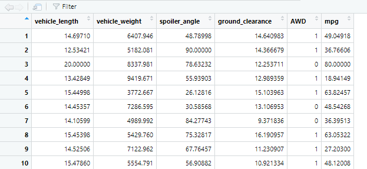
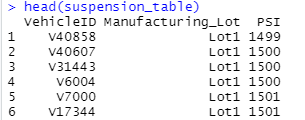
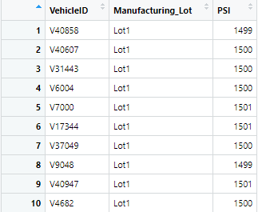
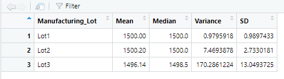
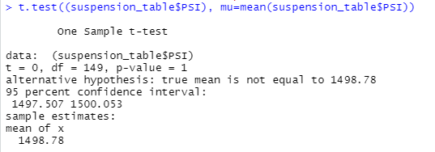
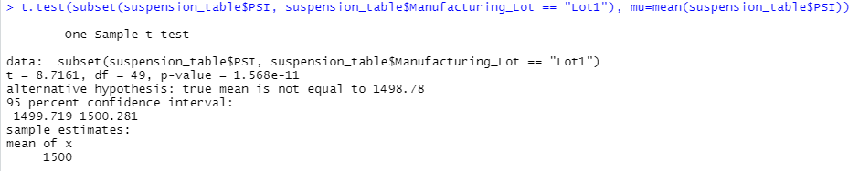
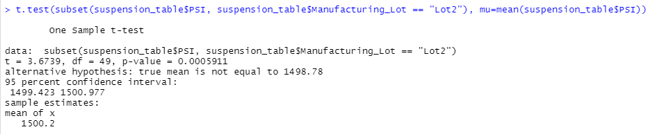
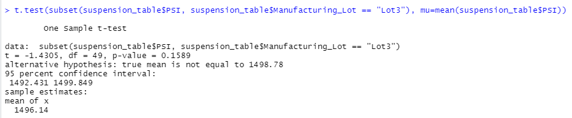

# MechaCar_R_Statistical_Analysis
Using R and statistics to analyze vehicle data from the automotive industry, specifically,  the production data of a prototype car.

## Project Background

AutosRUs is an automotive company with more than ten years of market presence. They have recently considered upgrading their decision-making processes to include a thorough statistical analysis component. 

The AutosRUs executive team recognizes that the most successful automobile launches utilize data analytics in every decision-making process. 
The company's data analytics team is in charge of performing retrospective analysis of historical data, analytical verification and validation of current automotive specifications, and studying the design of future product testing. 
Therefore, the analytics team must ensure that their analyses contain a statistical backbone, a quantitative metric, and a clear interpretation of the results to meet the demands of upper management. 

Additionally, the AutosRUs data team consists of five members who prefer to program using R.

More specifically, AutosRUs' newest prototype, the MechaCar, is suffering from production troubles blocking the manufacturing team's progress.
AutosRUs' upper management has requested a review of the production data for insights that may help the manufacturing team.

### Purpose

This project will perform statistical tests using the R programming language. 
We will provide summary statistics for different variables, visualizations for different datasets, and an interpretation of statistical test results. 
In addition, we will use critical thinking skills to propose a robust study design, hypothesis, and analysis workflow to enhance the AutosRUs manufacturing process.

## Objectives
1. Linear Regression to Predict MPG
2. Deliverable 2: Summary Statistics on Suspension Coils
3. T-Test on Suspension Coils
4. Design a Study Comparing the MechaCar to the Competition

## Resources
- Data source: [MechaCar MPG dataset](https://github.com/Magzzie/MechaCar_Statistical_Analysis/blob/main/Resources/MechaCar_mpg.csv), [Suspension Coil dataset](https://github.com/Magzzie/MechaCar_Statistical_Analysis/blob/main/Resources/Suspension_Coil.csv)
- Software: R (4.2.0), RStudio (2022.07.1-544)
- Libraries & Packages: tidyverse (1.3.1), dplyr (1.0.9).
- Online Tools: [MechaCar_Statistical_Analysis GitHub Repository](https://github.com/Magzzie/MechaCar_Statistical_Analysis)

## Methods

- Statistical Concepts applied: 
	- Data Distribution Characteristics
	- Null and Alternative Hypothesis Testing
	- Multiple Linear Regression
	- One-sample t-Tests
	- Determination of the most appropriate statistical test for a given hypothesis and dataset.
 
-  Using R, we designed a multiple linear regression model that predicts the mpg of MechaCar prototypes using several variables from the MechaCar_mpg.csv file. 
	- We ran the multiple linear regression R function (lm()) on all six variables:
		- The independent variables are vehicle length, vehicle weight, spoiler angle, drivetrain, and ground clearance.
		- The dependent variable is mpg.
- Then, using the summary() function, we determined the p-value and the r-squared value for the multiple linear regression model.
- To assess the production lots' performance, we evaluated the weights of suspension coils produced by each lot. 
- Using R, we created a summary statistics table to show:
	- The suspension coil's PSI continuous variable across all manufacturing lots. 
	- The following PSI metrics for each lot: mean, median, variance, and standard deviation.
- Next, we ran t-tests to compare the distribution means of manufacturing lots regarding the PSI of suspension coils to the population's mean of 1500.
 	- First, we compared all manufacturers to the population using a one-sample t-test.
	- Next, we used the subset() argument to compare the mean of each manufacturing lot separately to the population's, using one-sample t-tests.

## Results
### Linear Regression to Predict MPG
Performing multiple linear regression analysis to identify which variables in the dataset predict the mpg of MechaCar prototypes: 
- The MechaCar_mpg.csv dataset contains mpg test results for 50 prototype MechaCars.
- The MechaCar prototypes were produced using multiple design specifications to identify ideal vehicle performance.
- Multiple metrics were collected for each vehicle, such as vehicle length, vehicle weight, spoiler angle, drivetrain (AWD), and ground clearance.  

	|||
	|-|-|

- Using R, we designed a linear model that predicts the mpg of MechaCar prototypes using several variables from the MechaCar_mpg.csv file.  
	- The output of multiple linear regression using the lm() function produces the coefficients for each variable in the linear equation.
	- The values of coefficients from the model equation were as follows:  
	mpg = 6.267e+00 vehicle_length + 1.245e-03 vehicle_weight + 6.877e-02 spoiler_angle + 3.546e+00 ground_clearance + -3.411e+00 AWD + -1.040e+02 (intercept)
	- If we translate the numbers from scientific notifications to standard numbers and round to the nearest hundredth, we find that the results were as follows: 
	mpg = 6.27 vehicle_length + 0.00 vehicle_weight + 0.07 spoiler_angle + 3.55 ground_clearance + -3.41 AWD + -104.00  

	||
	|-|

- To determine which variables contributed significantly to the linear model, we looked at the individual variable p-values.
	- Each Pr(>|t|) value represents the probability that each coefficient contributes a random amount of variance to the linear model.
	- According to our results, vehicle length and ground clearance (as well as intercept) are statistically unlikely to provide random amounts of variance to the linear model. 
	- That means the vehicle length and ground clearance significantly impact the Mile-Per-Gallon fuel efficiency metric.
	- We notice that the intercept is statistically significant.
	- That means that the intercept term explains a significant amount of variability in the dependent variable when all independent variables are equal to zero. 
	- Based on our dataset, a significant intercept could mean that significant features (such as vehicle length and ground clearance) may need scaling or transforming to help improve the model's predictive power.
	- It could also mean that other variables can help explain the variability of our dependent variable that has not been included in our model.  
	- The overall R-Sqaured of the MLR model was 0.72 (Multiple R-squared:  0.7149) and the p-Value was very small 5.35 × 10-11 or < 0.001 (p-value: 5.35e-11)
	- Based on our calculated p-value and r-squared value, we have determined a significant relationship between vehicle length, ground clearance, and fuel efficiency of the MechaCar prototypes.  

	||
	|-|

### Summary Statistics on Suspension Coils
Collecting summary statistics on the pounds per square inch (PSI) of the suspension coils from the manufacturing lots:  
- The MechaCar Suspension_Coil.csv dataset contains the results from multiple production lots.
- In this dataset, the weight capacities of multiple suspension coils were tested to determine if the manufacturing process is consistent across production lots.

	|||
	|-|-|

- Summary statistics for all the weights of suspension coils produced by all lots were as follows: 
	- Mean: 1498.78
	- Median: 1500 
	- Variance: 62.29356
	- Standard Deviation: 7.892627 

	||
	|-|

- Furthermore, we analyzed the distribution of suspension coil weights per manufacturing lot, and the results were as follows:  

	|Manufacturing_Lot|Mean|Median|Variance|SD|
	|---|---|---|---|---|
	|**Lot 1**|1500.00|1500.00|0.980|0.990|
	|**Lot 2**|1500.20|1500.00|7.47|2.73|
	|**Lot 3**|1496.14|1498.5|170.29|13.05|

	||
	|-|

- The design specifications for the MechaCar suspension coils dictate that the variance of the suspension coils must not exceed 100 pounds per square inch.
	- Based on our analysis of the overall production weights, we thought all suspension coils produced for the prototype met the design requirement with a variance in weight capacities of 62.3. 
	- Looking into the production records for each manufacturing lot showed that lots 1 & 2 were in adherence with design standards.
	- However, lot 3 did not meet the requirements due to a variance of 170.3 in suspension coils PSI. 

### T-Tests on Suspension Coils
Running t-tests to determine if the manufacturing lots are statistically different from the mean population.  
- To determine if all manufacturing lots and each lot individually were statistically different from the population mean of 1,500 pounds per square inch,  
we ran a one-sample t-test where we compared all manufacturers' produced PSI mean to the population's mean.
	- The null hypothesis (H0): There is no statistical difference between the observed sample mean, and its presumed population mean. 
	- The alternate hypothesis (Ha): There is a statistical difference between the observed sample mean, and its presumed population mean. 
	- Assuming our significance level was the standard 0.05 percent, our p-value is above our significance level.
	- Therefore, we do not have sufficient evidence to reject the null hypothesis, and we would state that the two means are statistically similar.

	||
	|-|

- Then, we compared the means of distribution for each lot separately against the population of manufacturers' mean using the one-sample t-test again since we would be  
comparing a sample to the population. 
	- Lot 1: the p-Value for the t-test was (1.57 x 10^-11), which reflected a significant statistical difference.  
	Hence, we reject the null hypothesis and conclude that there is a statistical difference between lot 1 mean and all manufacturers' mean. 
	- Lot 2: the p-Value for the t-test was (0.0005911), which reflected a significant statistical difference.  
	Hence, we reject the null hypothesis and conclude that there is a statistical difference between lot 2 mean and all manufacturers' mean. 
	- Lot 3: the p-Value for the t-test was (0.1589), which reflected **no** significant statistical difference.  
	Hence, we fail to reject the null hypothesis and conclude that there is no statistical difference between lot 3 mean and all manufacturers' mean. 

	||
	|-|
	||
	||

## Study Design: MechaCar vs. Competition
	
We propose a design of a statistical study to compare the market power of the MechaCar vehicles against vehicles from other manufacturers.
- Background: While the MechaCar vehicle is still a prototype, we propose this market analysis study for future upgrades of the MechCar vehicle based on market value.  
Many aspects of a car's performance can be evaluated against manufacturers, including but not limited to  
the vehicle's cost, its fuel efficiency in cities and on highways, the horsepower of the engine, along with other metrics that could be influenced by both the car design and the consumer  
such as the cost of yearly maintenance and the safety of the vehicle. 
- Objective of the study: we intend to quantify how MechaCar performs against the competition in the marketplace.  
- Metrics: we intend to focus on the yearly maintenance cost of MechaCars against the competition and how that affects purchasing decisions for customers in the market.  
	Hence, we need information about the number of vehicles sold yearly and the yearly maintenance cost for MechaCars and other car manufacturers.  
	We would also include vehicle characteristics and performance metrics in the analysis. 
- Hypothesis Testing: 
	- Null Hypothesis (H0): Yearly maintenance costs do not influence the consumer's decision to purchase a MechaCar vehicle vs. a competitor's vehicle.
	- Alternate Hypothesis (H1): Yearly maintenance costs influence consumers' decision to purchase a MechaCar vehicle vs. a competitor's.
- Statistical Analysis: We intend to study the correlation between the number of vehicles sold yearly by each manufacturer and the maintenance costs.  
	Multiple linear regression would be the best statistical analysis method to evaluate whether there is a direct predicting effect of maintenance cost on purchasing against other performance and design metrics.  
	We will also perform two-sample t-tests to compare the distribution means of MechaCars sales against competitors. 

- Data: To test our null hypothesis, we need to collect numerical data about the competitors' vehicles and  
	expand the dataset of MechaCar vehicles to include more metrics related to yearly sales and maintenance costs. 

---
