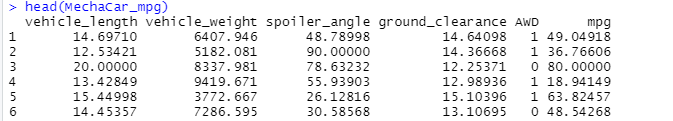
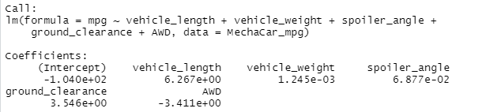
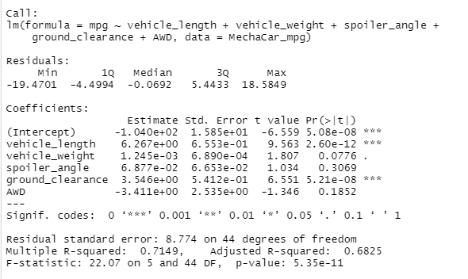

# MechaCar_R_Statistical_Analysis
Using R and statistics to analyze vehicle data from the automotive industry, specifically,  the production data of a prototype car.

## Project Background

AutosRUs is an automotive company with more than ten years of market presence. They have recently considered upgrading their decision-making processes to include a thorough statistical analysis component. 

The AutosRUs executive team recognizes that the most successful automobile launches utilize data analytics in every decision-making process. 
The company's data analytics team is in charge of performing retrospective analysis of historical data, analytical verification and validation of current automotive specifications, and studying the design of future product testing. 
Therefore, the analytics team must ensure that their analyses contain a statistical backbone, a quantitative metric, and a clear interpretation of the results to meet the demands of upper management. 

Additionally, the AutosRUs data team consists of five members who prefer to program using R.

More specifically, AutosRUs’ newest prototype, the MechaCar, is suffering from production troubles that are blocking the manufacturing team’s progress.
AutosRUs’ upper management has requested a review of the production data for insights that may help the manufacturing team.

### Purpose

This project will perform statistical tests using the R programming language. 
We will provide summary statistics for different variables, visualizations for different datasets, and an interpretation of statistical test results. 
In addition, we will use critical thinking skills to propose a robust study design, hypothesis, and analysis workflow to enhance the AutosRUs manufacturing process.

## Objectives
1. Linear Regression to Predict MPG
2. Deliverable 2: Summary Statistics on Suspension Coils
3. T-Test on Suspension Coils
4. Design a Study Comparing the MechaCar to the Competition

## Resources
- Data source: [MechaCar MPG dataset](https://github.com/Magzzie/MechaCar_Statistical_Analysis/blob/main/Resources/MechaCar_mpg.csv), [Suspension Coil dataset](https://github.com/Magzzie/MechaCar_Statistical_Analysis/blob/main/Resources/Suspension_Coil.csv)
- Software: R (4.2.0), RStudio (2022.07.1-544)
- Libraries & Packages: tidyverse (1.3.1), jsonlite (1.8.0), ggplot2 (3.3.6), Multiple Linear Regression
- Online Tools: [MechaCar_Statistical_Analysis GitHub Repository](https://github.com/Magzzie/MechaCar_Statistical_Analysis)

## Methods

- Statistical Concepts applied: 
	- ETL
	- Visualizations: line, bar, scatter, boxplots, heatmaps.
	- Data Distribution Characteristics
	- Null and Alternative Hypothesis Testing
	- Simple Linear Regression & Multiple Linear Regression
	- One-sample t-Tests, two-sample t-Tests, and Analysis of Variance (ANOVA)
	- Chi-squared test
	- A/B and A/A testing characteristics
	- Determination of the most appropriate statistical test for a given hypothesis and dataset. 
-  Using R, we designed a multiple linear regression model that predicts the mpg of MechaCar prototypes using several variables from the MechaCar_mpg.csv file. 
	- We ran the multiple linear regression R function (lm()) on all six variables:
		- The indpendent variables being:  vehicle length, vehicle weight, spoiler angle, drivetrain, and ground clearance.
		- The dependent variable being: mpg.
- Then, using the summary() function, we determined the p-value and the r-squared value for the multiple linear regression model.

## Results

1. Perform multiple linear regression analysis to identify which variables in the dataset predict the mpg of MechaCar prototypes.

- The MechaCar_mpg.csv dataset contains mpg test results for 50 prototype MechaCars.
- The MechaCar prototypes were produced using multiple design specifications to identify ideal vehicle performance.
- Multiple metrics, such as vehicle length, vehicle weight, spoiler angle, drivetrain (AWD), and ground clearance, were collected for each vehicle.  

	||
	|-|

- Using our knowledge of R, we designed a linear model that predicts the mpg of MechaCar prototypes using several variables from the MechaCar_mpg.csv file.  
	- The output of multiple linear regression using the lm() function produces the coefficients for each variable in the linear equation.
	- The values of coefficients from the model equation were as follows:  
	mpg = 6.267e+00 vehicle_length + 1.245e-03 vehicle_weight + 6.877e-02 spoiler_angle + 3.546e+00 ground_clearance + -3.411e+00 AWD + -1.040e+02 (intercept)
	- If we translate the numbers from scientific notifications to standard numbers and round to the nearest hundredth , we find that the results were as follows: 
	mpg = 6.27 vehicle_length + 0.00 vehicle_weight + 0.07 spoiler_angle + 3.55 ground_clearance + -3.41 AWD + -104.00  

	||
	|-|

- To determine which variables provided a significant contribution to the linear model, we looked at the individual variable p-values.
	- Each Pr(>|t|) value represents the probability that each coefficient contributes a random amount of variance to the linear model.
	- According to our results, vehicle length and ground clearance (as well as intercept) are statistically unlikely to provide random amounts of variance to the linear model. 
	- That means the vehicle length and ground clearance have a significant impact on Mile-Per_Gallon fuel efficincy metric.
	- We notice that the intercept is statistically significant.
	- That means that the intercept term explains a significant amount of variability in the dependent variable when all independent vairables are equal to zero. 
	- Depending on our dataset, a significant intercept could mean that the significant features (such as vehicle length and ground clearance) may need scaling or transforming to help improve the predictive power of the model.
	- It could also mean that there are other variables that can help explain the variability of our dependent variable that have not been included in our model.  
	- The overall R-Sqaured of the MLR model was 0.72 (Multiple R-squared:  0.7149) and the p-Value was very small 5.35 × 10-11 or 0.00 (p-value: 5.35e-11)
	- Based on our calculated p-value and r-squared value, we have determined that there is a significant relationship between vehicle length, ground clearance and fuel efficiency of the MechaCar prototypes.  

	||
	|-|

2. Collect summary statistics on the pounds per square inch (PSI) of the suspension coils from the manufacturing lots.

3. Run t-tests to determine if the manufacturing lots are statistically different from the mean population.

4. Design a statistical study to compare vehicle performance of the MechaCar vehicles against vehicles from other manufacturers.
- write a summary interpretation of the findings for each statistical analysis. 

## Conclusions

---